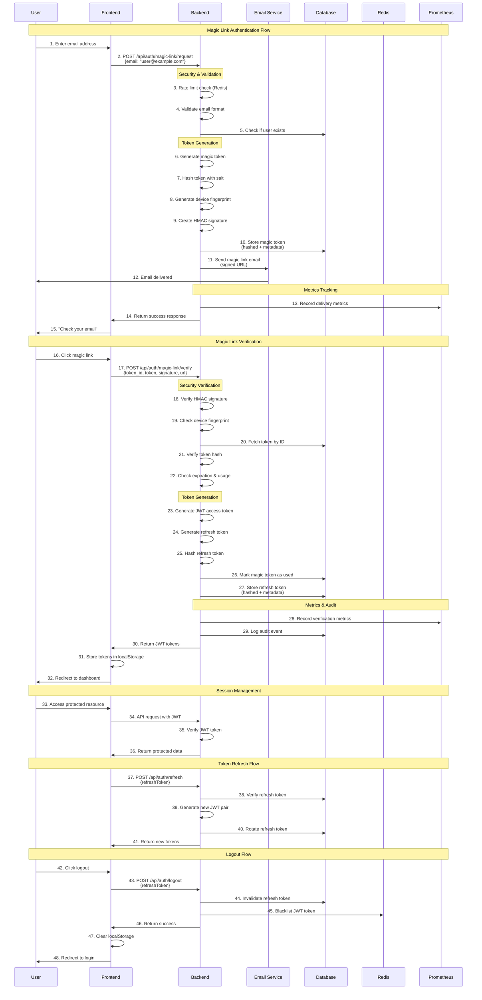

# Magic Link Authentication Demo

A production-ready magic link authentication system with comprehensive security, monitoring, and observability features.
https://github.com/huzayfa-jasat/Magic-Link-Demo
https://www.loom.com/share/b324328bb8914b4dbda3eb5b97ec4d08

## 🚀 Quick Start

```bash
# 1. Clone and setup
git clone <repository-url>
cd Magic-link-demo

# 2. Create environment file
cp env.example .env
# Edit .env with your values (see Environment Variables section)

# 3. Start everything with one command
docker compose -f compose_dev.yml up --build -d

# 4. Access the application
# Frontend: http://localhost:5173
# Backend API: http://localhost:11793
# Prometheus: http://localhost:9091
# PgAdmin: http://localhost:8080
```

## 📊 Architecture & Sequence Diagram



### 🔒 Security Features Highlighted
- **Rate Limiting**: Redis-based per-IP and per-email limits
- **Token Hashing**: All tokens stored with unique salts
- **HMAC Signatures**: Magic links protected against tampering
- **Device Fingerprinting**: Replay attack prevention
- **Audit Logging**: All security events tracked
- **Metrics Collection**: Comprehensive observability
- **Token Rotation**: Refresh tokens rotated on use
- **Blacklisting**: Compromised tokens immediately invalidated

## 🗄️ Database Schema

```sql
-- Users table
CREATE TABLE users (
    id UUID PRIMARY KEY DEFAULT gen_random_uuid(),
    email VARCHAR(255) UNIQUE NOT NULL,
    created_at TIMESTAMP DEFAULT NOW(),
    updated_at TIMESTAMP DEFAULT NOW()
);

-- Magic tokens (salted hashed)
CREATE TABLE magic_tokens (
    id UUID PRIMARY KEY DEFAULT gen_random_uuid(),
    user_id UUID REFERENCES users(id),
    token_hash VARCHAR(255) NOT NULL,
    token_salt VARCHAR(255) NOT NULL,
    expires_at TIMESTAMP NOT NULL,
    used BOOLEAN DEFAULT FALSE,
    nonce VARCHAR(255),
    device_fingerprint VARCHAR(255),
    ip_address INET,
    user_agent TEXT,
    created_at TIMESTAMP DEFAULT NOW()
);

-- Refresh tokens (salted hashed)
CREATE TABLE refresh_tokens (
    id UUID PRIMARY KEY DEFAULT gen_random_uuid(),
    user_id UUID REFERENCES users(id),
    token_hash VARCHAR(255) NOT NULL,
    token_salt VARCHAR(255) NOT NULL,
    expires_at TIMESTAMP NOT NULL,
    device_fingerprint VARCHAR(255),
    ip_address INET,
    user_agent TEXT,
    created_at TIMESTAMP DEFAULT NOW()
);

-- Audit logs
CREATE TABLE audit_logs (
    id UUID PRIMARY KEY DEFAULT gen_random_uuid(),
    user_id UUID REFERENCES users(id),
    action VARCHAR(100) NOT NULL,
    ip_address INET,
    user_agent TEXT,
    metadata JSONB,
    created_at TIMESTAMP DEFAULT NOW()
);
```

## 🔧 Environment Variables

| Variable | Purpose | Example |
|----------|---------|---------|
| `POSTGRES_DB` | Database name | `magic_link_demo` |
| `POSTGRES_USER` | Database username | `magic_link_user` |
| `POSTGRES_PASSWORD` | Database password | `change_me` |
| `POSTGRES_ROOT_PASSWORD` | Database root password | `change_me` |
| `PORT` | Application port | `11793` |
| `NODE_ENV` | Environment mode | `development` |
| `FRONTEND_URL` | Frontend URL for CORS | `http://localhost:5173` |
| `JWT_ACCESS_SECRET` | JWT access token secret | `change_me` |
| `JWT_REFRESH_SECRET` | JWT refresh token secret | `change_me` |
| `HMAC_SECRET` | HMAC signing secret | `change_me` |
| `SESSION_SECRET` | Session encryption secret | `change_me` |
| `RESEND_API_KEY` | Resend email service API key | `your_key_here` |
| `RATE_LIMIT_WINDOW` | Rate limit window (ms) | `900000` |
| `RATE_LIMIT_MAX_REQUESTS` | Max requests per window | `100` |
| `COOKIE_DOMAIN` | Cookie domain (production) | `yourdomain.com` |
| `TRUST_PROXY` | Trust reverse proxy | `true` |

### Setup Environment Variables

```bash
# 1. Copy example file
cp env.example .env

# 2. Edit with your values
nano .env

# 3. Docker Compose loads automatically
docker compose -f compose_dev.yml up -d
```

**Security Note**: Docker Compose loads `.env` file automatically without exposing values in process lists or logs. Never commit `.env` to version control.

## 📈 Service Level Objectives (SLOs)

| Metric | Target | Alert Threshold |
|--------|--------|----------------|
| **Availability** | 99.9% | < 99.5% for 5 minutes |
| **Magic Link Success Rate** | > 95% | < 95% for 5 minutes |
| **API Response Time (p95)** | < 2 seconds | > 2 seconds for 3 minutes |
| **Email Delivery Latency (p95)** | < 10 seconds | > 10 seconds for 3 minutes |
| **Error Rate** | < 5% | > 5% for 2 minutes |

## 🚨 Runbook for Common Incidents

### High Magic Link Failure Rate
```bash
# 1. Check metrics
curl http://localhost:11793/metrics | grep magic_link_verification_failures

# 2. Check logs
docker compose -f compose_dev.yml logs app --tail=50

# 3. Verify database connectivity
docker compose -f compose_dev.yml exec app psql -h db -U magic_link_user -d magic_link_demo -c "SELECT COUNT(*) FROM magic_tokens;"

# 4. Check email service
docker compose -f compose_dev.yml logs app | grep "Email sent successfully"

# 5. Restart if needed
docker compose -f compose_dev.yml restart app
```

### High API Latency
```bash
# 1. Check Prometheus metrics
open http://localhost:9091
# Query: histogram_quantile(0.95, rate(http_request_duration_seconds_bucket[5m]))

# 2. Check database performance
docker compose -f compose_dev.yml exec db psql -U magic_link_user -d magic_link_demo -c "SELECT * FROM pg_stat_activity;"

# 3. Check Redis
docker compose -f compose_dev.yml exec redis redis-cli info stats

# 4. Scale if needed
docker compose -f compose_dev.yml up --scale app=2 -d
```

### Email Delivery Failures
```bash
# 1. Check Resend API key
docker compose -f compose_dev.yml logs app | grep "Resend API Key"

# 2. Test email service
curl -X POST http://localhost:11793/api/auth/magic-link/request \
  -H "Content-Type: application/json" \
  -d '{"email":"test@example.com"}'

# 3. Check rate limits
docker compose -f compose_dev.yml exec redis redis-cli keys "*rate*"

# 4. Verify environment variables
docker compose -f compose_dev.yml exec app env | grep RESEND
```

### Database Connection Issues
```bash
# 1. Check database status
docker compose -f compose_dev.yml ps db

# 2. Test connection
docker compose -f compose_dev.yml exec app psql -h db -U magic_link_user -d magic_link_demo -c "SELECT 1;"

# 3. Check database logs
docker compose -f compose_dev.yml logs db --tail=20

# 4. Restart database
docker compose -f compose_dev.yml restart db
```

## 🔄 Rollback Plan

### Quick Rollback (Last Known Good Version)
```bash
# 1. Stop current services
docker compose -f compose_dev.yml down

# 2. Rollback to previous image
docker tag magic-link-demo-app:latest magic-link-demo-app:broken
docker tag magic-link-demo-app:previous magic-link-demo-app:latest

# 3. Restart services
docker compose -f compose_dev.yml up -d

# 4. Verify health
curl http://localhost:11793/health
```

### Database Rollback
```bash
# 1. Stop application
docker compose -f compose_dev.yml stop app

# 2. Restore database from backup
docker compose -f compose_dev.yml exec db pg_restore -U magic_link_user -d magic_link_demo /backup/backup.sql

# 3. Restart application
docker compose -f compose_dev.yml start app
```

### Configuration Rollback
```bash
# 1. Revert environment changes
git checkout HEAD~1 .env

# 2. Restart with old config
docker compose -f compose_dev.yml down
docker compose -f compose_dev.yml up -d
```

## 📊 Success Metrics & Monitoring

### Key Metrics to Monitor
- **`magic_link_success_rate`**: Verification success rate (target: >95%)
- **`magic_link_requests_total`**: Total magic link requests
- **`email_delivery_latency_seconds`**: Email delivery time (target: p95 < 10s)
- **`http_request_duration_seconds`**: API response time (target: p95 < 2s)
- **`magic_link_verification_failures_total`**: Failed verifications

### Prometheus Queries
```promql
# Success rate
magic_link_success_rate

# Request rate
rate(magic_link_requests_total[5m])

# 95th percentile latency
histogram_quantile(0.95, rate(http_request_duration_seconds_bucket[5m]))

# Error rate
rate(http_request_duration_seconds_count{status_code=~"5.."}[5m]) / rate(http_request_duration_seconds_count[5m])
```

### Alerting Rules
- **Low Success Rate**: `magic_link_success_rate < 0.95` for 5 minutes
- **High Latency**: `histogram_quantile(0.95, rate(http_request_duration_seconds_bucket[5m])) > 2`
- **High Error Rate**: `rate(http_request_duration_seconds_count{status_code=~"5.."}[5m]) / rate(http_request_duration_seconds_count[5m]) > 0.05`

## 🧪 Testing with Postman

Import the Postman collection: `postman/Magic_Link_Demo.postman_collection.json`

### Test Flow
1. **Register User**: `POST /api/auth/register`
2. **Request Magic Link**: `POST /api/auth/magic-link/request`
3. **Check Email**: Look for magic link in your inbox
4. **Verify Magic Link**: `POST /api/auth/magic-link/verify`
5. **Refresh Token**: `POST /api/auth/refresh`
6. **Logout**: `POST /api/auth/logout`

## 🔒 Security Features

- **Salted Token Hashing**: All tokens stored with unique salts
- **HMAC-Signed URLs**: Magic links protected against tampering
- **Replay Protection**: Device fingerprinting and nonce tracking
- **Rate Limiting**: Per-IP and per-email rate limits
- **Security Headers**: CSP, HSTS, X-Frame-Options, etc.
- **Secure Cookies**: HttpOnly, Secure, SameSite in production
- **Content-Type Validation**: Strict API endpoint validation

## 🛠️ Development Commands

```bash
# View logs
docker compose -f compose_dev.yml logs -f app

# Access database
docker compose -f compose_dev.yml exec db psql -U magic_link_user -d magic_link_demo

# Access Redis
docker compose -f compose_dev.yml exec redis redis-cli

# Rebuild and restart
docker compose -f compose_dev.yml up --build -d

# Stop everything
docker compose -f compose_dev.yml down

# Clean restart (removes volumes)
docker compose -f compose_dev.yml down -v
docker compose -f compose_dev.yml up --build -d
```

## 📞 Support

For issues or questions:
1. Check the logs: `docker compose -f compose_dev.yml logs app`
2. Verify metrics: `http://localhost:9091`
3. Test endpoints: Use the Postman collection
4. Check this runbook for common incidents

---

**Status**: ✅ Production Ready | **Last Updated**: September 2025 | **Version**: 1.0.0
